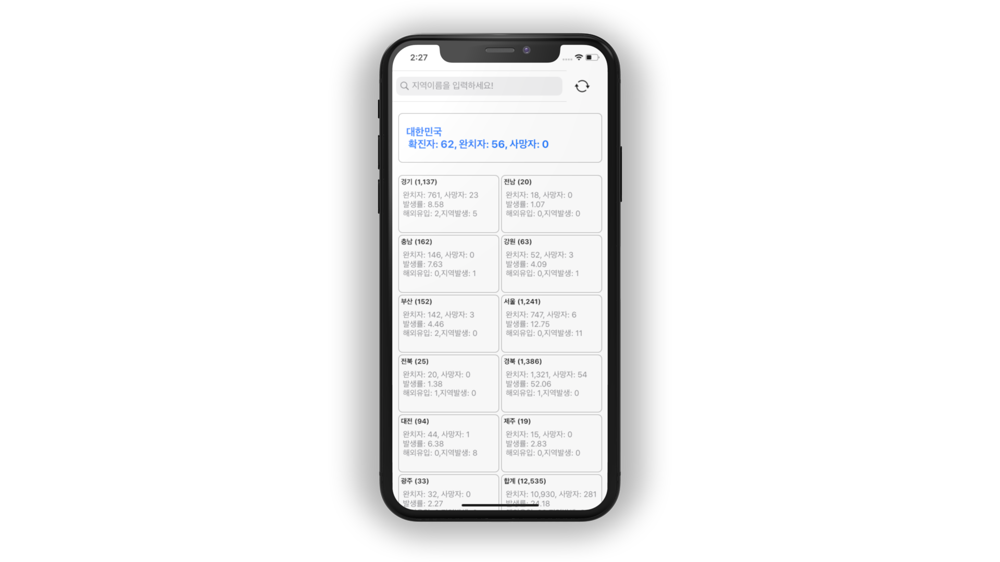

# Corona19Demo
This app shows the number of people affected by corona virus. 
Data shows by region. (Seoul, Daegu, Jeju)

## What I try to implement 
- Practice Network API and programmatic UI
- Update data using [UICollectionViewDiffableDataSource](https://developer.apple.com/documentation/uikit/uicollectionviewdiffabledatasource) 
- DiffableDataSource introduced [WWDC2019](https://developer.apple.com/videos/play/wwdc2019/220/)

## Rest-API
[Corona19API Github](https://github.com/dhlife09/Corona-19-API)

## To-Do
- [X] Create Initial UI using code
- [X] Parsing Json Data and mapping structure 
- [X] Display data in UICollectionView
- [X] Modify label text style (font size, line height)

## Screenshot

   

## Version 
- v1.0 - upload initial app
- v1.1 - modify text style and update code

## UI 
This app will change design while on developing.

## Author
oddukgi 😎 (sm.kang666@gmail.com)
