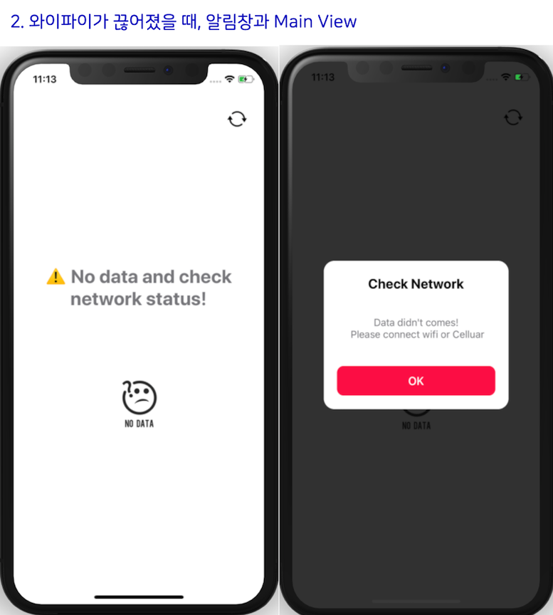

# Corona19Demo
This app shows the number of people affected by corona virus. 
Data shows by region. (Seoul, Daegu, Jeju)

## Tech Usage

- Update data using [UICollectionViewDiffableDataSource](https://developer.apple.com/documentation/uikit/uicollectionviewdiffabledatasource) 
- [Corona19API Github](https://github.com/dhlife09/Corona-19-API)

## Simulation Video
[App Simulation](https://drive.google.com/file/d/1Jz53a-gV73GjSad1G9Xif7KJdD4J39GT/view?usp=sharing)

## Screenshot 
### Main Screen
{: width="66%" height="66%"}

### Empty Stateview
{: width="66%" height="66%"}

## Author
oddukgi 😎 (sm.kang666@gmail.com)
